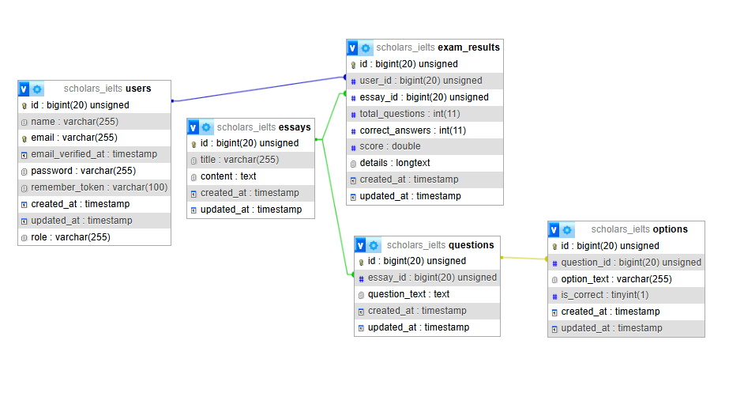

## Scholars IELTS Reading API

---

Proyek ini adalah sistem backend berbasis Laravel untuk aplikasi latihan soal IELTS Reading. Sistem ini mencakup manajemen konten (essay/passage), sistem penilaian otomatis, dan otentikasi menggunakan JWT (JSON Web Token).

---

## Fitur

---

1. Manajemen Soal IELTS: CRUD lengkap untuk essay, pertanyaan, dan pilihan jawaban.

2. Sistem Penilaian Otomatis: Menghitung skor berdasarkan jawaban user secara real-time.

3. Otentikasi JWT: Registrasi dan login aman menggunakan jwt-auth.

4. Email : Menggunakan SMTP Gmail untuk mengirimkan Hello saat regis dan NotifScore saat selesai menjawab.

5. RBAC (Role-Based Access Control): Perbedaan hak akses antara user dan admin.

6. Dokumentasi Swagger: Dokumentasi API interaktif yang dapat dicoba langsung melalui browser juga Postman sebagai test API external.

---

## Stack

Framework: Laravel 11

Email Sender : SMTP Gmail ( Saat regis & sent notifscore akan nunggu loading sekitar 1-2 detik dikarenakan masih menggunakan send biasa belum menggunakan queue/background job)

Bahasa: PHP 8.x

Database: MySQL

Dokumentasi: L5-Swagger (OpenAPI 3.0)

Otentikasi: JWT Auth

## Installation 

1. Clone Repository
   By use terminal/cmd

```sh
git clone https://github.com/Kevinmajesta/scholars-ielts-app.git
```

2. Instal dependensi:
   By use terminal/cmd

```sh
composer install
```

2. Check the .env file and configure with your device

3. Enable the MySql database

4. Run the command to create the database and migrate it.

5. Setup environment

```sh
.env.example .env
php artisan key:generate
php artisan jwt:secret
```

6. Migrasi & Seed:

```sh
php artisan migrate --seed
```

7. Run the application

```sh
php artisan serve
```

---

## Development

This project app develope by 1 people
| Name | Github |
| ------ | ------ |
| Kevin | https://github.com/Kevinmajesta |

By using github for development for staging and production.

## API Documentation

Proyek ini menggunakan Swagger untuk dokumentasi. Setelah server berjalan, akses melalui:
http://localhost:8000/api/documentation atau postman

```sh
link web :
https://www.postman.com/lunar-resonance-148572/workspace/kevin-work/collection/33423852-9eb10270-a2eb-4c4b-b6a8-9add52620480?action=share&source=copy-link&creator=33423852
for the the api spec :)
or http://localhost:8000/api/documentation for swagger UI
```

## AI Question

1. kira kira dari test diatas, table yg di pake apa aja yg hrus ku buat?
2. Apakah CSRF ini bawaaan dari laravel breeze?
3. UBAH CSRF DI LARAVEL KE JWT gmna chat?
4. Konek jwt ke controller di laravel gmn chat
5. cara install swagger ui gmna
6. apakah swagger ui dgn postman untuk cek api sama? atau beda
7. tolong bikin anotsi buat swagger ui
8. ini error apa

```sh
PS D:\Magang\scholars-ielts-app> php artisan l5-swagger:generate.

   ERROR  Command "l5-swagger:generate. Did you mean one of these?  

  ⇂ key:generate  
  ⇂ l5-swagger:generate  

PS D:\Magang\scholars-ielts-app> 
```
9. Tolong Bikin readme project ini dari test yang kukirim diatas
10. CHat apakah ietls ini ada question yang tanpa essay? atau semua question ake essay semua
11. Password smtp apakah belum tanpa spasi chat, di laravel error klo pake spasi
12. cara masukin image di readme gmn chat


## Relasi Database

